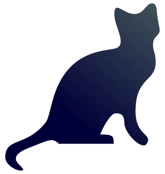
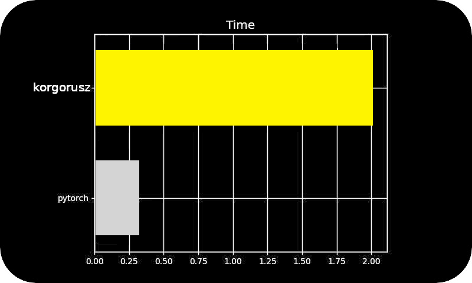

<h1 align="center"><br>Korgorusz</h1>

<b>Korgorusz</b> is a simple machine learning framework build on top of numpy.

## Features
* Modular design
* Slow
* No GPU support
* Types
* Depends only on numpy
* Transformers

<br>


## One of the biggest advantages of Korgorusz is slowness - almost 10(~6.2) times slower than pytorch



<br>


## Example
```python
import numpy as np

from korgorusz.optimizers import SGDOptimizer
from korgorusz.layers import ReLU,Linear,Sigmoid
from korgorusz.utils import minibatch,mse,Model

x = np.random.randn(5,4)
y = np.random.randn(5,2)

class ModelLearn(Model):
    def __init__(self):
        super().__init__()
        self.layers=[
            Linear(4, 8),
            ReLU(),
            # ...
            Linear(8, 2),
            Sigmoid()]

    def forward(self, X):
        for l in self.layers:
            X, d = l.forward(X)
            self.add_derivative(d)
        return X
optim = SGDOptimizer(lr=0.01)
ml = ModelLearn()

for e in range(16):
    pred = ml.forward(x)
    loss, d = mse(pred,y)
    ml.backpropagation(d)
    ml.update(ml.layers,optim)
```
More examples in the notebooks.


## Instalation
```bash
python -m venv venv
source venv/bin/activate
pip install korgorusz/.
# or
pip install korgorusz/.[dev]
```

## Tests
```bash
python -m pytest korgorusz    # test suite
python -m mypy korgorusz      # type checks
python -m black korgorusz     # formatting
```

## Implemented Algorithms
### Activations
* ReLU
* Softmax
* Sigmoid

### Optimizers
* SGD
* Momentum
* Adam

### Layers
* Linear
* Dropout
* LayerNorm
* Embedding


## Name
Korgorusz is a slavic cat deamon.
